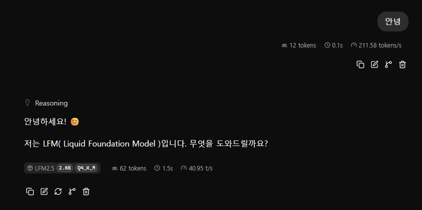
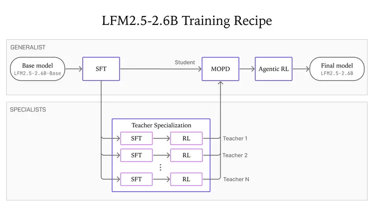
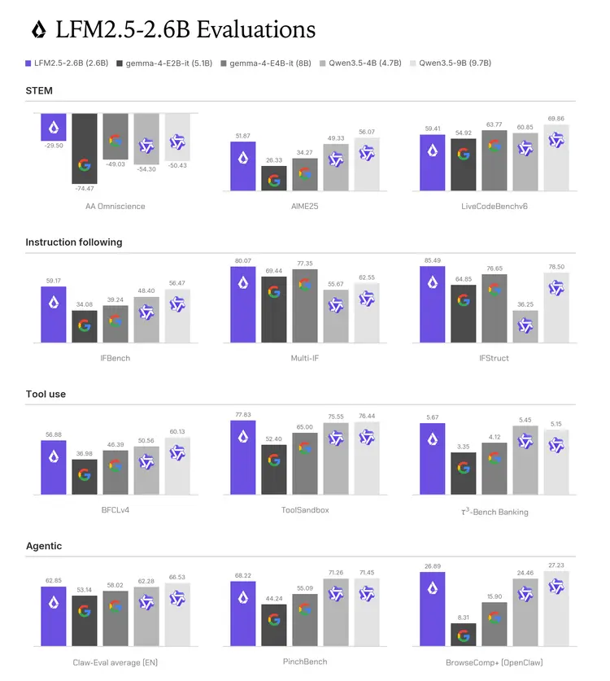
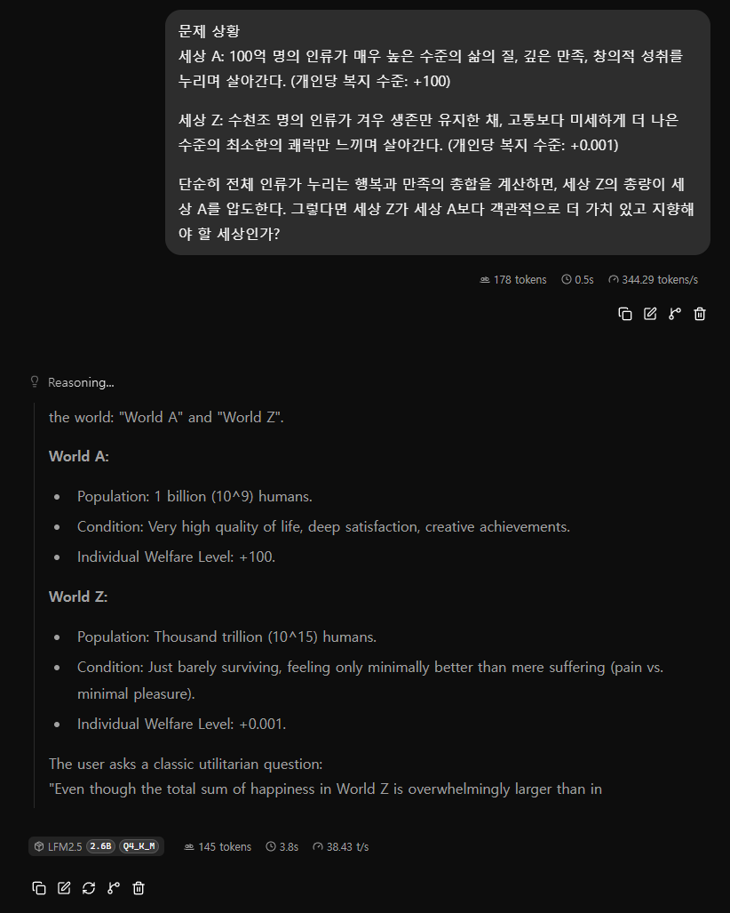
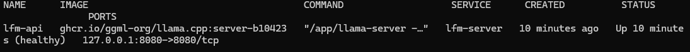
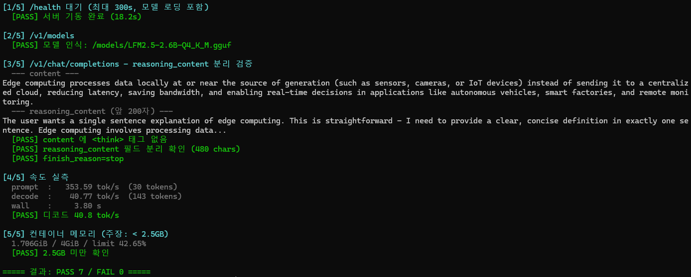
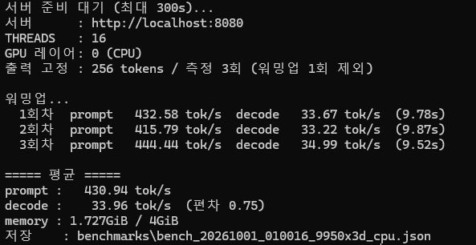
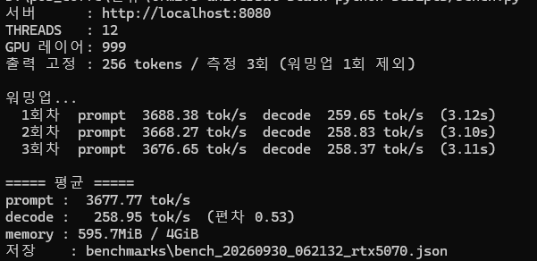
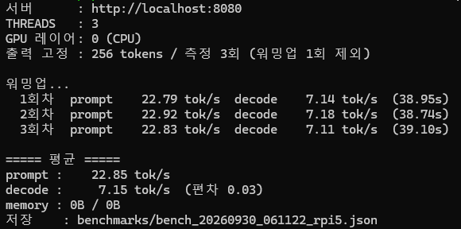
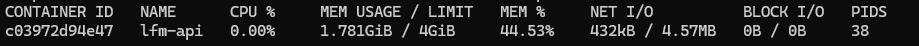

# LFM2.5 Universal Stack

> Liquid AI 의 온디바이스 모델 LFM2.5-2.6B 를 llama.cpp 서버로 실행하는 Docker Compose 스택이다.
>
> `.env` 하나만 수정하여 노트북, 데스크톱, 라즈베리파이, 또는 [Oracle Cloud의 A1 서버](https://github.com/kyeong9743/oracle-cloud-macro)와 같은 시스템에서 실행할 수 있고, NVIDIA GPU 가 있으면 GPU 가속까지 쓸 수 있다.




## 목차

1. [소개](#1-소개)
2. [주요 기능](#2-주요-기능)
3. [시작](#3-시작)
4. [성능](#4-성능)
5. [사용 시 주의점](#5-사용-시-주의점)
6. [설정과 운영](#6-설정과-운영)
7. [참고 자료](#7-참고-자료)

---

## 1. 소개

### LFM2.5-2.6B



LFM2.5-2.6B 는 Liquid AI 가 2026년 8월 4일에 공개한 2.6B 크기의 언어 모델이다. 스마트폰이나 노트북 같은 기기 안에서 직접 돌리는 것(온디바이스)을 목표로 만들어졌고, 도구 호출과 여러 단계에 걸친 작업 같은 에이전트 용도에 맞춰 학습되었다. Q4_K_M 양자화 기준으로 메모리를 2.5GB 도 쓰지 않는다.

30개 층 중 22개는 계산이 가벼운 합성곱(short convolution) 블록이고, 8개 층에만 어텐션(GQA)을 넣은 하이브리드 구조다.

| 항목 | 내용 |
|---|---|
| 개발사 | Liquid AI |
| 공개일 | 2026.08.04 |
| 파라미터 | 2.69B |
| 구조 | 30층 하이브리드 (double-gated short convolution 22개 + GQA 8개) |
| 학습량 | 34조(34T) 토큰 |
| 컨텍스트 | 131,072 토큰 (128K) |
| 어휘 크기 | 128,000 |
| 지원 언어 | 한국어 포함 16개 |
| 권장 샘플링 | temperature 0.1, top_k 50, repetition_penalty 1.1 |
| 라이선스 | LFM Open License v1.0 |
| 이 스택에서 쓰는 파일 | Q4_K_M GGUF, 1,674,455,040 bytes (약 1.56 GiB, 2026.09.22 갱신본) |

| 권장 용도 | 비권장 용도 |
|---|---|
| 에이전트 워크플로, 도구 호출 | 에이전트형 코딩 |
| 데이터 추출, RAG | 지식을 많이 요구하는 작업 |
| 긴 컨텍스트 작업 | |

#### 공식 벤치마크 (일부)



| 벤치마크 | 분야 | LFM2.5-2.6B | Gemma-4-E4B-it | Qwen3.5-4B | Qwen3.5-9B |
|---|---|---|---|---|---|
| IFBench | 지시 따르기 | **59.17** | 39.24 | 48.40 | 56.47 |
| Multi-IF | 지시 따르기 | **80.07** | 77.35 | 55.67 | 62.55 |
| IFStruct | 구조화 출력 | **85.49** | 76.65 | 36.25 | 78.50 |
| ToolSandbox | 도구 사용 | **77.83** | 65.00 | 75.55 | 76.44 |
| BFCLv4 | 도구 호출 | 56.88 | 46.39 | 50.56 | **60.13** |
| LiveCodeBenchv6 | 코딩 | 59.41 | 63.77 | 60.85 | **69.86** |

지시 따르기와 도구 사용에 강하고, 코딩은 상대적으로 약하다.

출처: Hugging Face 모델 카드, Liquid AI 공식 블로그. 전체 표와 상세 내용은 아래 링크에 있다.

* **[Hugging Face 모델 카드](https://huggingface.co/LiquidAI/LFM2.5-2.6B)** : 스펙, 벤치마크 원문
* **[Liquid AI 공식 블로그](https://www.liquid.ai/blog/lfm2-5-2-6b)** : 공개 발표, 기기별 속도
* **[파이토치 한국 사용자 모임](https://discuss.pytorch.kr/t/liquid-ai-lfm2-5-2-6b/11549)** : 한국어 소개글

### 이 프로젝트

LFM2.5-2.6B 를 llama.cpp 서버로 실행하는 Docker Compose 스택이다. 하나의 `docker-compose.yml` 을 쓰고, 장비별 차이(스레드 수, 코어 제한, 메모리, 외부 접속 여부)는 `.env` 로 조정한다.

| 항목 | 내용 |
|---|---|
| 검증한 장비 | 노트북 (Core Ultra 7 258V), 데스크톱 (Ryzen 9 9950X3D + RTX 5070), 라즈베리파이 5 |

* **[GitBook (프로젝트 문서)](https://kyeong9743.gitbook.io/kyeong9743/home/lfm2.5-2.6b)** : 시스템 구조도, 상세 문서
* **[Velog (개발 일지)](https://velog.io/@kyeong9743/LFM2.5-1)** : 작업 과정, 구현 이슈 및 트러블슈팅 기록

---

## 2. 주요 기능

- **CPU(기본), GPU(선택)** : 기본은 CPU 로 실행된다. NVIDIA GPU 가 있으면 `docker-compose.gpu.yml` 을 함께 지정하여 GPU 로 실행한다.
- **OpenAI 호환 API** : llama.cpp 서버의 OpenAI 호환 API 와 내장 Web UI 를 그대로 사용한다.
- **추론 과정 분리** : 모델이 답변 전에 생성하는 `<think>` 를 `reasoning_content` 로 분리하고, `content` 에는 최종 답변만 남긴다.
- **하드웨어 프로파일** : 노트북, 데스크톱, 라즈베리파이 5, Oracle Cloud A1 용 설정을 `.env.example` 에 미리 넣어 두었다.
- **검증 스크립트** : 다운로드할 때 sha256 을 확인하고, 실행 후에는 `test_api` 로 동작 확인, `bench.py` 로 장비에서의 속도 비교가 가능하다.



---

## 3. 시작

### 필요 조건

- Docker, Docker Compose
- 디스크 여유 공간 2GB 이상 (모델 파일 1.67GB)
- GPU 를 쓸 경우 NVIDIA 드라이버, NVIDIA Container Toolkit (Windows 는 Docker Desktop WSL2 백엔드면 드라이버만 있으면 된다)

### Linux / macOS / 라즈베리파이

```bash
git clone https://github.com/kyeong9743/lfm2.5-universal-stack.git
cd lfm2.5-universal-stack
cp .env.example .env            # 하드웨어 프로파일 설정 (6장 참고)
./scripts/download_model.sh     # 모델 다운로드 (1.67GB) + sha256 검증
docker compose up -d
python3 scripts/test_api.py           # 동작 테스트
```

### Windows (PowerShell)

```powershell
Copy-Item .env.example .env     # 하드웨어 프로파일 설정 (6장 참고)
.\scripts\download_model.ps1    # 모델 다운로드 (1.67GB) + sha256 검증
docker compose up -d
python3 scripts/test_api.py          # 동작 테스트
```

### GPU 로 실행 (NVIDIA)

```bash
docker compose -f docker-compose.yml -f docker-compose.gpu.yml up -d --force-recreate
```

CPU 로 되돌릴 때는 `-f` 없이 다시 올린다.

```bash
docker compose up -d --force-recreate
```

| `.env` 변수 | 기본값 | 설명 |
|---|---|---|
| `GPU_IMAGE_TAG` | `server-cuda-b10423` | CUDA 12 빌드. CUDA 13 빌드는 `server-cuda13-b10423` |
| `GPU_LAYERS` | `999` | GPU 에 올릴 레이어 수. 999 는 전부. VRAM 이 부족하면 줄인다 |

### 실행 확인

<!-- 사진: docker compose ps 에서 lfm-api 가 (healthy) 로 보이는 화면 -->


<!-- 사진: test_api 실행 결과 (PASS 7 / FAIL 0) -->


- Web UI : <http://localhost:8080>
- API : `POST http://localhost:8080/v1/chat/completions`

```bash
curl http://localhost:8080/v1/chat/completions \
  -H "Content-Type: application/json" \
  -d '{"model":"lfm2.5-2.6b","messages":[{"role":"user","content":"안녕"}]}'
```

---

## 4. 성능

`scripts/bench.py` 로 출력을 256 토큰으로 고정해 측정했다. 워밍업 1회 뒤 3회 평균이다.

| 장비 | 실행 방식 | prompt (tok/s) | decode (tok/s) | 메모리 |
|---|---|---|---|---|
| RTX 5070 (+ 9950X3D) | GPU | 3,677.8 | **259.0** | RAM 0.6 GiB + VRAM 약 2.0 GB |
| Ryzen 9 9950X3D | CPU 16 스레드 | 430.9 | 34.0 | 1.73 GiB |
| Core Ultra 7 258V | CPU 6 스레드 | - | 25.1 | 1.70 GiB |
| 라즈베리파이 5 8GB | CPU 3 스레드 | 22.8 | 7.1 | 1.92 GiB |

- **prompt** : 입력을 처리하는 속도 / **decode** : 답변을 만들어 내는 속도
- 같은 PC 에서 GPU 를 쓰면 decode 가 CPU 의 약 7.6배다.
- 라즈베리파이 5 에서도 초당 7 토큰 정도로 대화가 가능하다.







```bash
python scripts/bench.py --label 장비이름
```

---

## 5. 사용 시 주의점

LFM2.5-2.6B 는 답변 전에 항상 `<think>` 블록부터 생성하는 추론 모델이고, 이 동작은 끌 수 없다.

### 사고 과정은 `reasoning_content` 로 분리된다

`LLAMA_ARG_THINK=deepseek` 설정으로 사고 과정은 `message.reasoning_content` 에, 최종 답변은 `message.content` 에 담긴다. 기존 OpenAI 클라이언트를 붙여도 `<think>` 가 섞이지 않는다.

> ※ `deepseek` 은 DeepSeek 모델과 관계없는 llama.cpp 의 출력 포맷 이름이다.

### max_tokens 는 2048 이상으로

`max_tokens` 에는 사고 토큰도 포함된다. 값이 작으면 사고하다가 토큰을 다 써서 `content` 가 빈 문자열로 온다.

| `max_tokens` | `finish_reason` | content |
|---|---|---|
| 400 | `length` | 0자 (빈 응답) |
| 1024 | `stop` | 182자 |
| 2048 | `stop` | 90자 |

- **클라이언트** : `max_tokens` 를 2048 이상으로 주거나 생략한다. (1024 에서도 빈 응답이 나온 질문이 있었다)
- **서버** : `.env` 에 `THINK_BUDGET=256` 을 설정하면 사고가 256 토큰에서 끊겨서 `max_tokens=400` 으로도 답변이 나온다.

### 사양이 낮은 장비는 THINK_BUDGET 으로 사고를 제한한다

사고 토큰만큼 첫 답변이 늦게 나온다. 라즈베리파이 5 (7 tok/s) 에서는 256 토큰만 사고해도 첫 답변까지 30초 넘게 걸린다.

```
THINK_BUDGET=-1     무제한 (기본값, 고사양 장비)
THINK_BUDGET=256    256 토큰에서 사고 종료 (라즈베리파이, A1 권장)
THINK_BUDGET=0      사고 즉시 종료 (품질 저하가 커서 비권장)
```

### 그 밖에

- 한국어로 질문해도 사고 과정은 대부분 영어로 나오고, 답변만 한국어로 나온다.
- 작은 모델이라 숫자 단위를 틀리는 경우가 있다. ("100억" 을 "1 billion(10억)" 으로 옮김)
- 메모리를 아끼기 위해 컨텍스트를 4096 으로 줄여 두었다. 긴 문서를 다루려면 `CTX_SIZE` 를 늘린다.

---

## 6. 설정과 운영

### 하드웨어 프로파일

`.env.example` 아래쪽의 [A]~[D] 블록은 테스트환경의 예제파일이다. 가동환경에 맞춰 설정한다.

| 프로파일 | 장비 | THREADS | CPUSET | BIND_ADDR | 비고 |
|---|---|---|---|---|---|
| [A] | Core Ultra 7 258V | 6 | 없음 | 127.0.0.1 | |
| [B] | Ryzen 9 9950X3D | 16 | 없음 | 127.0.0.1 | GPU 옵션 사용 가능 |
| [C] | 라즈베리파이 5 8GB | 4 | `0-2` | 127.0.0.1 | |
| [D] | Oracle Cloud A1 2 OCPU | 2 | 없음 | 127.0.0.1 | |

- `THREADS` 는 CPU 코어 수보다 크게 잡지 않는다. Docker Desktop 은 `docker info --format '{{.NCPU}}'` 에 나오는 개수가 기준이다.
- `CPUSET` 은 컨테이너가 쓸 코어를 제한한다. 다른 서비스와 같이 돌아가는 장비에서는 꼭 지정한다.

### 외부 노출

1. `.env` 에서 `BIND_ADDR=0.0.0.0` 으로 변경
2. `.env` 에 `API_KEY=<충분히 긴 랜덤 문자열>` 설정 (비워두면 인증 없이 공개된다)
3. `ENDPOINT_SLOTS=0` 으로 내부 상태 엔드포인트 차단
4. 프록시에서 `ai.example.com → http://<서버 IP>:8080` 연결 + HTTPS 인증서 발급
5. 요청할 때 `Authorization: Bearer <API_KEY>` 헤더 추가

```bash
curl https://ai.example.com/v1/chat/completions \
  -H "Authorization: Bearer $API_KEY" \
  -H "Content-Type: application/json" \
  -d '{"model":"lfm2.5-2.6b","messages":[{"role":"user","content":"안녕"}]}'
```

설정이 끝나면 키 없이 요청했을 때 401 이 돌아오는지 꼭 확인한다.

### 기본 명령어

```bash
docker compose up -d              # 실행
docker compose ps                 # (healthy) 상태 확인
docker compose logs -f            # 실시간 로그
docker compose down               # 중지 + 컨테이너 삭제 (모델, 설정 파일은 유지)
docker stats lfm-api --no-stream  # 메모리, CPU 사용량
```

<!-- 사진: docker stats 로 메모리 사용량을 확인한 화면 (2.5GB 미만) -->


### 설정을 바꿨을 때

`.env` 는 컨테이너를 만들 때 적용된다. `docker compose restart` 로는 반영되지 않으니 항상 새로 만든다.

```bash
docker compose up -d --force-recreate
docker exec lfm-api sh -c 'echo $LLAMA_ARG_THREADS'   # 적용된 값 확인
```

### 엔진 업그레이드

```bash
docker manifest inspect ghcr.io/ggml-org/llama.cpp:server-b<새 빌드 번호>
# .env 의 IMAGE_TAG (GPU 는 GPU_IMAGE_TAG) 수정 후
docker compose pull && docker compose up -d --force-recreate
./scripts/test_api.sh
```

LFM2.5 는 llama.cpp `b10262` 이상에서만 동작한다. 이보다 낮은 빌드로 내리지 않는다.

### 프로젝트 구조

```
lfm2.5-universal-stack/
├── docker-compose.yml       # 모든 장비 공통. 수정하지 않는다
├── docker-compose.gpu.yml   # NVIDIA GPU 옵션 (선택)
├── .env.example             # 하드웨어 프로파일 프리셋
├── models/                  # GGUF 파일 위치 (컨테이너에 read-only 로 마운트)
├── benchmarks/              # bench.py 측정 결과 (JSON, 커밋하지 않음)
├── docs/                    # 업로드용 이미지
└── scripts/
    ├── download_model.sh / .ps1   # 모델 다운로드 + 파일 크기, sha256 검증
    ├── test_api.sh / .ps1         # health → 추론 → reasoning 분리 → tok/s → 메모리 확인
    ├── test_api.py                # 파이썬 클라이언트 예제 겸 검증 스크립트
    └── bench.py                   # 장비 간 속도 비교
```

파이썬 스크립트는 `openai` 나 `requests` 패키지 없이 표준 라이브러리만으로 돌아간다.

```bash
python scripts/test_api.py                                  # 일반 요청
python scripts/test_api.py --stream                         # SSE 스트리밍
python scripts/test_api.py --max-tokens 2048 --prompt "질문"
```

---

## 7. 참고 자료

- [LiquidAI/LFM2.5-2.6B (Hugging Face)](https://huggingface.co/LiquidAI/LFM2.5-2.6B)
- [LiquidAI/LFM2.5-2.6B-GGUF (Hugging Face)](https://huggingface.co/LiquidAI/LFM2.5-2.6B-GGUF)
- [Liquid AI 공식 블로그](https://www.liquid.ai/blog/lfm2-5-2-6b)
- [Liquid AI 공식 문서](https://docs.liquid.ai/lfm/models/lfm25-2.6b)
- [파이토치 한국 사용자 모임 소개글](https://discuss.pytorch.kr/t/liquid-ai-lfm2-5-2-6b/11549)
- [ggml-org/llama.cpp (GitHub)](https://github.com/ggml-org/llama.cpp)

모델 라이선스는 LFM Open License v1.0 이다. 연구, 비영리, 연 매출 1,000만 달러 미만 조직은 자유롭게 쓸 수 있고, 그 이상인 기업이 상업적으로 쓰려면 Liquid AI 와 별도로 협의해야 한다.
